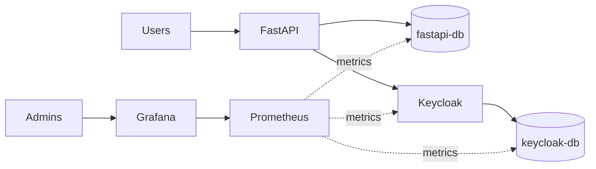

# Heroes Helm Chart

## Architecture

## Enable network policies
Network policies block all egress traffic of pod to internet to prevent data and allow only necessary traffic to permit operations.

To permit FastAPI to call k8s API to deploy minio you have to add the ips of k8s master nodes. The ips can be obtain with the command
`kubectl get endpoints --namespace default kubernetes`

Example of Yaml:
```
networkpolicies:
  enabled: true
  k8s_api:
    ips:
    - "x.x.x.x"
    - "x.x.x.y"
    - "x.x.x.z"
```

## Enable monitoring
```
keycloak:
  metrics:
    enabled: true
postgresql:
  metrics:
    enabled: true
prometheus:
  enabled: false
grafana:
  enabled: true
loki:
  enabled: true
  
sealed_secrets:
  grafana:
    user: "sealed username"
    password: "sealed password"
```
